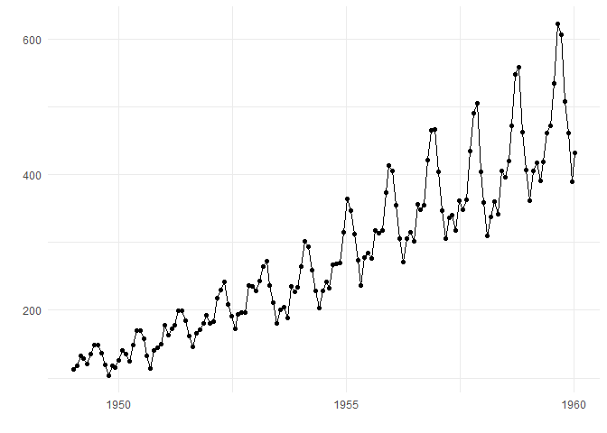
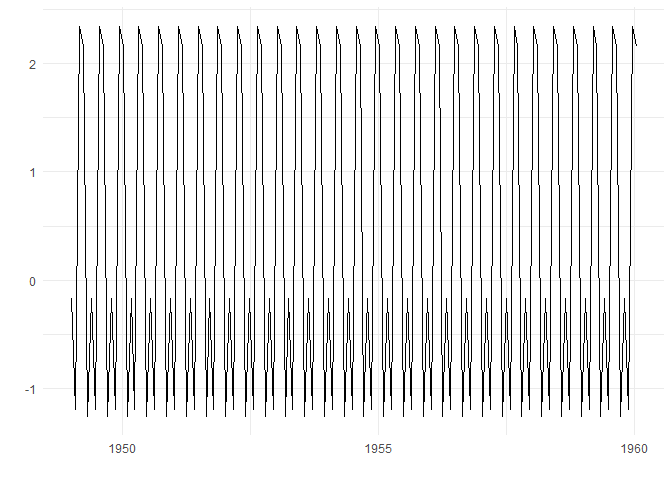

<!-- README.md is generated from README.Rmd. Please edit that file -->

# tsextras

<!-- badges: start -->

[](https://www.tidyverse.org/lifecycle/#experimental)
<!-- badges: end -->

The goal of tsextras is to provide helper functions to analyse time
series objects.

## Installation

You can install the development version from
[GitHub](https://github.com/) with:

``` r
# install.packages("devtools")
devtools::install_github("alberto-mateos-mo/tsextras")
```

## Example

`ts_plot()` function is a wrapper for other functions that plot ts
objects.

``` r
library(tsextras)
library(ggplot2)

ts_plot(AirPassengers)
```



`ts_trend()` extracts and plots the trend of a time series.

``` r
library(tsextras)
library(ggplot2)

ts_trend(AirPassengers, order = 12)
#> Registered S3 method overwritten by 'xts':
#>   method     from
#>   as.zoo.xts zoo
#> Registered S3 method overwritten by 'quantmod':
#>   method            from
#>   as.zoo.data.frame zoo
#> Registered S3 methods overwritten by 'forecast':
#>   method             from    
#>   fitted.fracdiff    fracdiff
#>   residuals.fracdiff fracdiff
#> $trend.series
#>           Jan      Feb      Mar      Apr      May      Jun      Jul      Aug
#> 1949       NA       NA       NA       NA       NA       NA 126.7917 127.2500
#> 1950 131.2500 133.0833 134.9167 136.4167 137.4167 138.7500 140.9167 143.1667
#> 1951 157.1250 159.5417 161.8333 164.1250 166.6667 169.0833 171.2500 173.5833
#> 1952 183.1250 186.2083 189.0417 191.2917 193.5833 195.8333 198.0417 199.7500
#> 1953 215.8333 218.5000 220.9167 222.9167 224.0833 224.7083 225.3333 225.3333
#> 1954 228.0000 230.4583 232.2500 233.9167 235.6250 237.7500 240.5000 243.9583
#> 1955 261.8333 266.6667 271.1250 275.2083 278.5000 281.9583 285.7500 289.3333
#> 1956 309.9583 314.4167 318.6250 321.7500 324.5000 327.0833 329.5417 331.8333
#> 1957 348.2500 353.0000 357.6250 361.3750 364.5000 367.1667 369.4583 371.2083
#> 1958 375.2500 377.9167 379.5000 380.0000 380.7083 380.9583 381.8333 383.6667
#> 1959 402.5417 407.1667 411.8750 416.3333 420.5000 425.5000 430.7083 435.1250
#> 1960 456.3333 461.3750 465.2083 469.3333 472.7500 475.0417       NA       NA
#>           Sep      Oct      Nov      Dec
#> 1949 127.9583 128.5833 129.0000 129.7500
#> 1950 145.7083 148.4167 151.5417 154.7083
#> 1951 175.4583 176.8333 178.0417 180.1667
#> 1952 202.2083 206.2500 210.4167 213.3750
#> 1953 224.9583 224.5833 224.4583 225.5417
#> 1954 247.1667 250.2500 253.5000 257.1250
#> 1955 293.2500 297.1667 301.0000 305.4583
#> 1956 334.4583 337.5417 340.5417 344.0833
#> 1957 372.1667 372.4167 372.7500 373.6250
#> 1958 386.5000 390.3333 394.7083 398.6250
#> 1959 437.7083 440.9583 445.8333 450.6250
#> 1960       NA       NA       NA       NA
#> 
#> $trend.plot
#> Warning: Removed 12 rows containing missing values (geom_path).
```


    #> 
    #> $detrended.series
    #>             Jan        Feb        Mar        Apr        May        Jun
    #> 1949         NA         NA         NA         NA         NA         NA
    #> 1950 -16.250000  -7.083333   6.083333  -1.416667 -12.416667  10.250000
    #> 1951 -12.125000  -9.541667  16.166667  -1.125000   5.333333   8.916667
    #> 1952 -12.125000  -6.208333   3.958333 -10.291667 -10.583333  22.166667
    #> 1953 -19.833333 -22.500000  15.083333  12.083333   4.916667  18.291667
    #> 1954 -24.000000 -42.458333   2.750000  -6.916667  -1.625000  26.250000
    #> 1955 -19.833333 -33.666667  -4.125000  -6.208333  -8.500000  33.041667
    #> 1956 -25.958333 -37.416667  -1.625000  -8.750000  -6.500000  46.916667
    #> 1957 -33.250000 -52.000000  -1.625000 -13.375000  -9.500000  54.833333
    #> 1958 -35.250000 -59.916667 -17.500000 -32.000000 -17.708333  54.041667
    #> 1959 -42.541667 -65.166667  -5.875000 -20.333333  -0.500000  46.500000
    #> 1960 -39.333333 -70.375000 -46.208333  -8.333333  -0.750000  59.958333
    #>             Jul        Aug        Sep        Oct        Nov        Dec
    #> 1949  21.208333  20.750000   8.041667  -9.583333 -25.000000 -11.750000
    #> 1950  29.083333  26.833333  12.291667 -15.416667 -37.541667 -14.708333
    #> 1951  27.750000  25.416667   8.541667 -14.833333 -32.041667 -14.166667
    #> 1952  31.958333  42.250000   6.791667 -15.250000 -38.416667 -19.375000
    #> 1953  38.666667  46.666667  12.041667 -13.583333 -44.458333 -24.541667
    #> 1954  61.500000  49.041667  11.833333 -21.250000 -50.500000 -28.125000
    #> 1955  78.250000  57.666667  18.750000 -23.166667 -64.000000 -27.458333
    #> 1956  83.458333  73.166667  20.541667 -31.541667 -69.541667 -38.083333
    #> 1957  95.541667  95.791667  31.833333 -25.416667 -67.750000 -37.625000
    #> 1958 109.166667 121.333333  17.500000 -31.333333 -84.708333 -61.625000
    #> 1959 117.291667 123.875000  25.291667 -33.958333 -83.833333 -45.625000
    #> 1960         NA         NA         NA         NA         NA         NA
    #> 
    #> $order.f
    #> [1] 12

`ts_season()` extracts and plots seasonal component of a time series.

``` r
library(tsextras)
library(ggplot2)

s <- AirPassengers
x <- ts_trend(s)
ts_season(x)
#> Warning in matrix(data = x$detrended.series, nrow = x$order): data length [144]
#> is not a sub-multiple or multiple of the number of rows [5]
#> $season.series
#>   [1] -0.1714286 -1.1928571  2.3428571  2.1571429 -1.2571429 -0.1714286
#>   [7] -1.1928571  2.3428571  2.1571429 -1.2571429 -0.1714286 -1.1928571
#>  [13]  2.3428571  2.1571429 -1.2571429 -0.1714286 -1.1928571  2.3428571
#>  [19]  2.1571429 -1.2571429 -0.1714286 -1.1928571  2.3428571  2.1571429
#>  [25] -1.2571429 -0.1714286 -1.1928571  2.3428571  2.1571429 -1.2571429
#>  [31] -0.1714286 -1.1928571  2.3428571  2.1571429 -1.2571429 -0.1714286
#>  [37] -1.1928571  2.3428571  2.1571429 -1.2571429 -0.1714286 -1.1928571
#>  [43]  2.3428571  2.1571429 -1.2571429 -0.1714286 -1.1928571  2.3428571
#>  [49]  2.1571429 -1.2571429 -0.1714286 -1.1928571  2.3428571  2.1571429
#>  [55] -1.2571429 -0.1714286 -1.1928571  2.3428571  2.1571429 -1.2571429
#>  [61] -0.1714286 -1.1928571  2.3428571  2.1571429 -1.2571429 -0.1714286
#>  [67] -1.1928571  2.3428571  2.1571429 -1.2571429 -0.1714286 -1.1928571
#>  [73]  2.3428571  2.1571429 -1.2571429 -0.1714286 -1.1928571  2.3428571
#>  [79]  2.1571429 -1.2571429 -0.1714286 -1.1928571  2.3428571  2.1571429
#>  [85] -1.2571429 -0.1714286 -1.1928571  2.3428571  2.1571429 -1.2571429
#>  [91] -0.1714286 -1.1928571  2.3428571  2.1571429 -1.2571429 -0.1714286
#>  [97] -1.1928571  2.3428571  2.1571429 -1.2571429 -0.1714286 -1.1928571
#> [103]  2.3428571  2.1571429 -1.2571429 -0.1714286 -1.1928571  2.3428571
#> [109]  2.1571429 -1.2571429 -0.1714286 -1.1928571  2.3428571  2.1571429
#> [115] -1.2571429 -0.1714286 -1.1928571  2.3428571  2.1571429 -1.2571429
#> [121] -0.1714286 -1.1928571  2.3428571  2.1571429 -1.2571429 -0.1714286
#> [127] -1.1928571  2.3428571  2.1571429 -1.2571429 -0.1714286 -1.1928571
#> [133]  2.3428571  2.1571429 -1.2571429 -0.1714286 -1.1928571  2.3428571
#> [139]  2.1571429 -1.2571429 -0.1714286 -1.1928571  2.3428571  2.1571429
#> 
#> $season.plot
```



    #> 
    #> $random.series
    #>               Jan          Feb          Mar          Apr          May
    #> 1949           NA           NA   7.25714286  -0.15714286 -10.74285714
    #> 1950  -8.14285714  -3.15714286  13.85714286  -0.02857143 -17.80714286
    #> 1951   0.85714286  -5.02857143  17.59285714  -7.54285714  -8.15714286
    #> 1952   0.99285714  -0.54285714   9.24285714  -8.74285714 -17.82857143
    #> 1953  -4.95714286 -14.14285714  17.77142857   8.39285714 -14.74285714
    #> 1954   2.57142857 -21.80714286  15.05714286  -4.75714286 -17.14285714
    #> 1955   4.85714286 -17.15714286  12.05714286  -1.62857143 -25.80714286
    #> 1956   6.65714286 -16.62857143  16.39285714  -9.14285714 -31.15714286
    #> 1957   6.39285714 -26.54285714  18.84285714  -7.14285714 -34.02857143
    #> 1958   5.64285714 -21.54285714  15.97142857 -16.00714286 -39.14285714
    #> 1959   9.17142857 -25.00714286  18.85714286 -13.35714286 -27.14285714
    #> 1960  15.85714286 -29.75714286 -11.74285714   5.57142857 -28.60714286
    #>               Jun          Jul          Aug          Sep          Oct
    #> 1949  -1.02857143  11.59285714   8.45714286   2.84285714  -4.74285714
    #> 1950  -3.14285714  13.44285714  15.25714286   9.17142857  -8.80714286
    #> 1951  -2.94285714  12.77142857  15.79285714   3.65714286 -11.55714286
    #> 1952   8.39285714  11.25714286  21.84285714   1.45714286 -10.42857143
    #> 1953  -7.75714286  16.25714286  26.77142857   5.39285714 -11.54285714
    #> 1954   0.17142857  32.79285714  21.25714286  -0.35714286 -12.34285714
    #> 1955  -0.34285714  40.24285714  25.85714286   5.37142857 -14.40714286
    #> 1956  10.65714286  40.17142857  35.59285714   2.65714286 -24.75714286
    #> 1957  11.79285714  40.05714286  43.84285714   7.65714286 -24.62857143
    #> 1958   4.44285714  52.65714286  66.37142857  -8.60714286 -26.34285714
    #> 1959  -6.82857143  56.79285714  66.85714286  -6.95714286 -30.94285714
    #> 1960  -6.54285714  71.24285714  60.85714286  -9.22857143 -17.20714286
    #>               Nov          Dec
    #> 1949 -14.22857143   2.79285714
    #> 1950 -26.34285714   1.44285714
    #> 1951 -18.54285714   1.17142857
    #> 1952 -19.20714286   1.85714286
    #> 1953 -28.75714286   5.45714286
    #> 1954 -29.22857143   2.99285714
    #> 1955 -42.34285714   5.84285714
    #> 1956 -38.34285714   6.37142857
    #> 1957 -40.20714286   4.45714286
    #> 1958 -46.15714286  -3.34285714
    #> 1959 -48.62857143   9.79285714
    #> 1960           NA           NA
